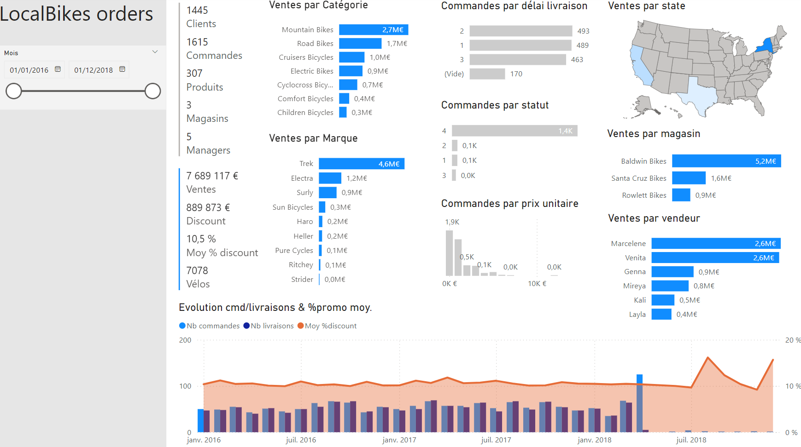
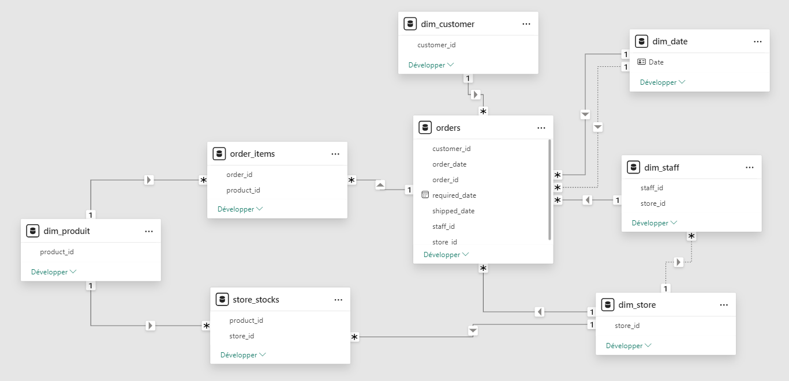
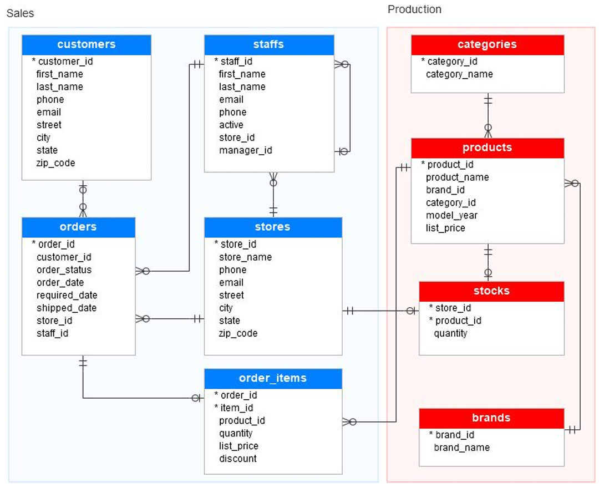
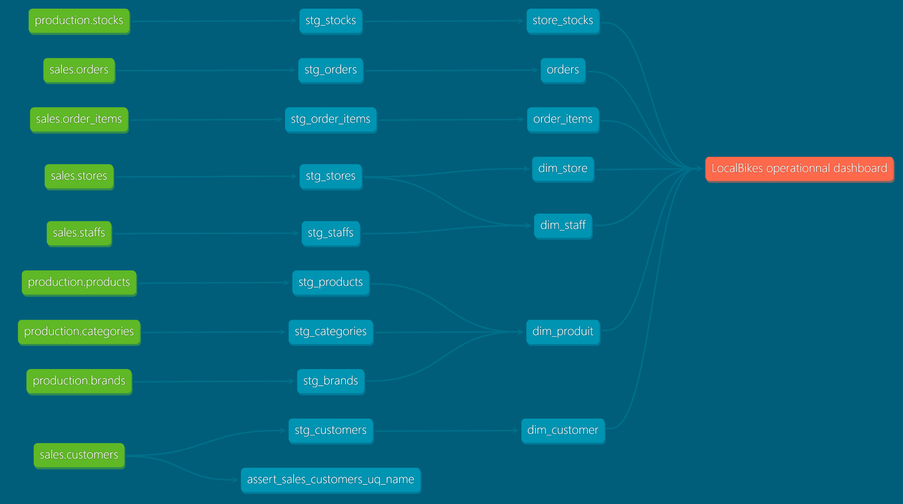

# LocalBikes Exploration

Here is a [dbt-core](https://github.com/dbt-labs/dbt-core) project that loads & transform **LocalBikes** data, a fictive bike company used by DataBird Analytics Engineering learning

## Viz' exploration



### Modèle



## Data sources

**Origin**
- [Kaggle > Bike store sample database](https://www.kaggle.com/datasets/dillonmyrick/bike-store-sample-database/data)
- [SQL Server Sample Database](https://www.sqlservertutorial.net/getting-started/sql-server-sample-database/)

**Sales** : `customers`, `stores`, `staffs`, `orders`, `order_items`

**Production** : `products`, `brands`, `categories`, `stocks`



## Schema/DB steps

- **raw** : raw tables loaded as is from .csv
- **stg** : intermediate tables
- **dtm** : tables ready for analytics & reporting use



## Setup

### Database

- 🦆 [DuckDB](https://duckdb.org/) 🚀
- [BigQuery](https://console.cloud.google.com/bigquery)

### Requirements

`uv pip install dbt-bigquery dbt-duckdb`

### Profiles.yml

```yml
# profiles.yml
dbt_localbikes:
  target: dev
  outputs:
    dev:
      type: duckdb
      path: localbikes.db
      # extensions:
        # - httpfs
        # - spatial
      threads: 4
    prod:
      type: bigquery
      method: service-account
      project: GCP_PROJECT_ID
      dataset: dbt_localbikes
      location: europe-west9
      threads: 4
      keyfile: /PATH/TO/BIGQUERY/keyfile.json
```

### raw data loading

trough `dbt seeds` cmd \
activate it in `dbt_projetct.yml` for 1st load
