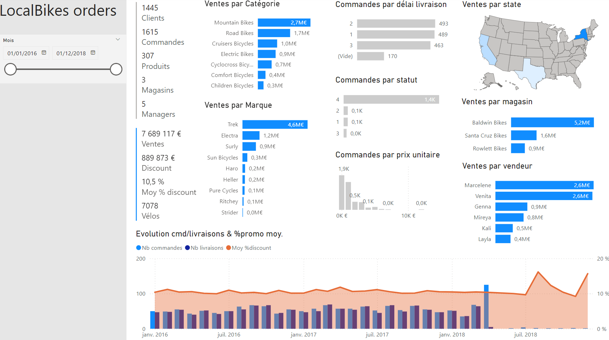
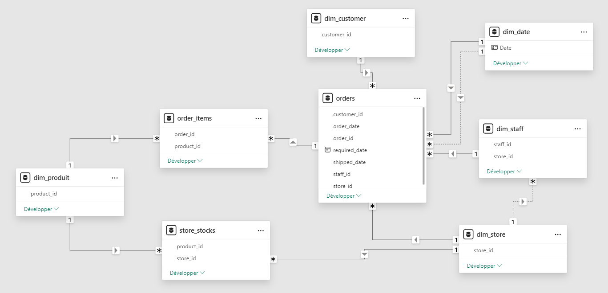



# LocalBikes Modelisation

## Data sources :

- **Sales**
  - `customers`
  - `stores`
  - `staffs`
  - `orders`
    - `order_items`
- **Production**
  - `products`
    - `brands`
    - `categories`
  - `stocks`

## Schema/DB steps :

- **raw** : raw tables loaded as is from .csv
  - here trough `dbt seeds` cmd \
    activate it in `dbt_projetct.yml` for 1st load)
- **stg** : intermediate tables
- **dtm** : tables ready for analytics & reporting use

## Viz' exploration

### Modèle

